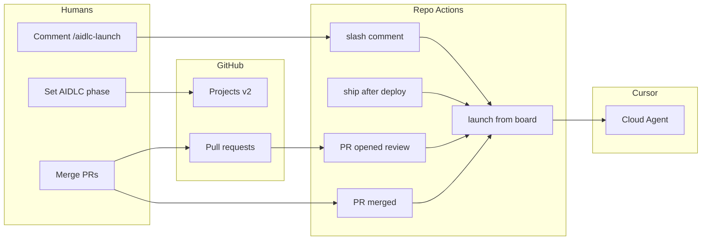

# GitHub AIDLC queue — Projects v2 + Cursor Cloud Agents

Headless AI-DLC for consumer repos uses:

- **Projects v2** single-select **`AIDLC phase`** (override with repo variable **`AIDLC_PHASE_FIELD_NAME`**).
- **Workflow templates** under [`docs/templates/github-workflows/`](templates/github-workflows/) — copy into **your app repo** as `.github/workflows/*.yml`.
- **Composite action** at `.claude/deps/ai-dlc/.github/actions/aidlc-launch` (after AI-DLC submodule init).
- **Cursor Cloud Agents** API (`CURSOR_API_KEY`) with phase prompts from the composite action.

Process narrative: [`docs/templates/AIDLC.md`](templates/AIDLC.md). Tracker-agnostic rules: [`ISSUE-TRACKER-PORTABILITY.md`](ISSUE-TRACKER-PORTABILITY.md). Classic Projects + cron legacy: [`GITHUB-AIDLC-PROJECT.md`](GITHUB-AIDLC-PROJECT.md) Tier C.

**Validate vs Learn:** `/ship` runs the **Validate** phase only. **`/learn`** is manual after PASS ([`skills/learn/SKILL.md`](../skills/learn/SKILL.md)) — not a GitHub Actions job.

---

## Quick start

1. Add AI-DLC submodule at `.claude/deps/ai-dlc` ([`CONSUMER-SETUP.md`](CONSUMER-SETUP.md)).
2. Create a **Projects v2** board with single-select field **`AIDLC phase`** and options: `Idea`, `Plan`, `Design`, `Build`, `Review`, `Ship`, `Done`, `Won't do`.
3. Configure **secrets**, **variables**, and **labels** (below).
4. Copy queue templates from [`docs/templates/github-workflows/`](templates/github-workflows/) into your repo:

| Template | Copy as | Purpose |
|----------|---------|---------|
| [`aidlc-launch-from-board.yml`](templates/github-workflows/aidlc-launch-from-board.yml) | `.github/workflows/aidlc-launch-from-board.yml` | Central launcher — reads board phase, starts Cursor agent |
| [`aidlc-pr-merged.yml`](templates/github-workflows/aidlc-pr-merged.yml) | `.github/workflows/aidlc-pr-merged.yml` | Merge → advance phase + dispatch (Ship deferred) |
| [`aidlc-pr-opened-review.yml`](templates/github-workflows/aidlc-pr-opened-review.yml) | `.github/workflows/aidlc-pr-opened-review.yml` | PR opened → Build→Review + review agent (no CI wait) |
| [`aidlc-ship-after-deploy.yml`](templates/github-workflows/aidlc-ship-after-deploy.yml) | `.github/workflows/aidlc-ship-after-deploy.yml` | After deploy/smoke CI → Validate agent |
| [`aidlc-issue-comment-launch.yml`](templates/github-workflows/aidlc-issue-comment-launch.yml) | `.github/workflows/aidlc-issue-comment-launch.yml` | `/aidlc-launch` comment on issue |
| [`aidlc-project-phase-reconcile.yml`](templates/github-workflows/aidlc-project-phase-reconcile.yml) | `.github/workflows/aidlc-project-phase-reconcile.yml` | Manual drift repair (no cron) |
| [`aidlc-agent-launch.yml`](templates/github-workflows/aidlc-agent-launch.yml) | `.github/workflows/aidlc-agent-launch.yml` | **Optional** legacy: `aidlc_work:unstarted` label |

5. Configure Cursor Cloud Agents env: **`AIDLC_GH_CALLBACK_TOKEN`** (PAT with `repo` — **not** a GitHub Actions secret).

---

## Architecture



**No cron for phase detection.** Primary in-repo paths:

1. **Merge pipeline** — `aidlc-pr-merged.yml` advances the board and dispatches the next agent (except Ship waits for deploy CI).
2. **PR opened** — `aidlc-pr-opened-review.yml` moves Build→Review and starts review without waiting for CI.
3. **`/aidlc-launch`** on the tracking issue after a manual board drag.
4. **`workflow_dispatch`** on `aidlc-launch-from-board.yml`.
5. **Optional** org webhook `projects_v2_item` → relay → `repository_dispatch` **`aidlc_board_launch`** (zero-touch board drag).

**Manual reconcile only:** `aidlc-project-phase-reconcile.yml` compares cached phase snapshots and dispatches on transitions — run when automation was offline.

---

## Secrets and variables

### GitHub Actions secrets

| Secret | Purpose |
|--------|---------|
| `CURSOR_API_KEY` | [Cursor Integrations → API Keys](https://cursor.com/dashboard/integrations) |
| `AIDLC_PROJECT_PAT` | PAT with **`project`** scope for Projects v2 GraphQL (org boards usually require this instead of `GITHUB_TOKEN`) |

### GitHub Actions variables

| Variable | Purpose |
|----------|---------|
| `AIDLC_PROJECT_OWNER` | Login owning the board URL (defaults to repo owner in workflows) |
| `AIDLC_PROJECT_OWNER_TYPE` | `organization` or `user` |
| `AIDLC_PROJECT_NUMBER` | Project number from `/orgs/…/projects/N` — **required** |
| `AIDLC_PHASE_FIELD_NAME` | Optional; default field title **`AIDLC phase`** |
| `AIDLC_DEPLOY_WORKFLOW_NAME` | Optional; display name for deploy workflow (default `Deploy to Staging`) — keep in sync with `aidlc-ship-after-deploy.yml` `on.workflow_run.workflows` |
| `AIDLC_SMOKE_WORKFLOW_NAME` | Optional; smoke workflow display name (default `UI smoke (staging)`) |
| `AIDLC_DEPLOY_WORKFLOW_FILE` | Optional; workflow **file** id for deploy run correlation (default `deploy-staging.yml`) |

### Cursor dashboard (not GitHub)

| Name | Purpose |
|------|---------|
| `AIDLC_GH_CALLBACK_TOKEN` | PAT with **`repo`** so agents can comment and clear `aidlc_work:in_progress` |

### Labels

- `aidlc_work:unstarted` — legacy label launch
- `aidlc_work:in_progress` — mutex; blocks duplicate launches from merge, comment, reconcile, and `repository_dispatch`

---

## Issue linking on PRs

PR merge and Ship automation resolve the tracking issue from the PR title/body using **explicit** patterns only:

- `Closes #N` / `Fixes #N` / `Resolves #N`
- `Relates to #N`

Bare `#517` in prose is intentionally ignored (ambiguous when multiple references exist).

---

## Ship after deploy CI

When merge advances to **Ship**, Cursor is **not** launched immediately. [`aidlc-ship-after-deploy.yml`](templates/github-workflows/aidlc-ship-after-deploy.yml) listens for your deploy and smoke workflows:

1. Edit `on.workflow_run.workflows` to match your workflow **display names** exactly.
2. Optionally set `AIDLC_DEPLOY_WORKFLOW_*` variables so the script correlates deploy runs with smoke runs.
3. On deploy failure → Ship agent runs with `ship_ci_status=failed_deploy` (failure handler, no browser).
4. On smoke complete → Ship agent runs with CI context (`success` or `failed_smoke`).

If you have no deploy/smoke workflows yet, omit `aidlc-ship-after-deploy.yml` and use manual `workflow_dispatch` on `aidlc-launch-from-board` when ready to Validate.

---

## Org webhook relay (optional)

GitHub does **not** expose `projects_v2_item` as a repository workflow trigger ([gh-aw#25336](https://github.com/github/gh-aw/issues/25336)). For immediate launch on board drag without `/aidlc-launch`:

1. Add an **organization** webhook for `projects_v2_item`.
2. Filter for your project, field name, and phase transitions into Plan/Design/Build/Review/Ship.
3. POST to `POST /repos/{owner}/{repo}/dispatches` with:

```json
{
  "event_type": "aidlc_board_launch",
  "client_payload": { "issue_number": 123 }
}
```

`aidlc-launch-from-board.yml` skips duplicate runs when `aidlc_work:in_progress` is set (for `repository_dispatch` only).

---

## Composite action inputs

The composite at [`.github/actions/aidlc-launch/action.yml`](../.github/actions/aidlc-launch/action.yml) supports org/user Projects v2, optional explicit `issue-number`, and Ship CI context inputs (`ship-prs-json`, `ship-deploy-sha`, `ship-ci-status`, etc.) consumed by `aidlc-ship-after-deploy.yml`.

Consumer repos reference it via submodule path:

```yaml
- uses: ./.claude/deps/ai-dlc/.github/actions/aidlc-launch
```

Optional: copy the composite to `.github/actions/aidlc-launch` in your app repo if you prefer shorter paths (document any local fork; merge carefully on submodule bumps).

---

## Minimal tier (without full queue)

For a first integration, use only [`aidlc-agent-launch.yml`](templates/github-workflows/aidlc-agent-launch.yml) + label `aidlc_work:unstarted`. See [`GITHUB-AIDLC-PROJECT.md`](GITHUB-AIDLC-PROJECT.md) Tier B.
